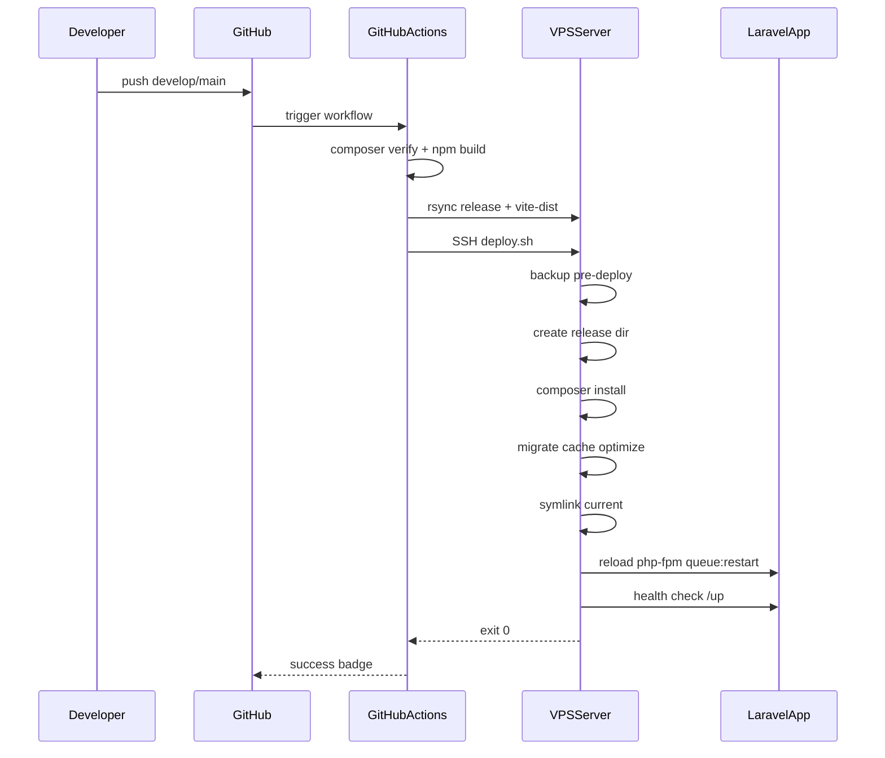

# 1. Architektura deploymentu

## Diagram ASCII

```text
┌─────────────┐     push/PR      ┌──────────────────┐
│  Developer  │ ───────────────► │     GitHub       │
│ (2–5 osób)  │                  │  main / develop  │
└─────────────┘                  │  feature/* ...   │
                                 └────────┬─────────┘
                                          │
                          ┌───────────────┼───────────────┐
                          │               │               │
                   push develop      push main      PR → verify
                          │               │               │
                          ▼               ▼               ▼
                 ┌────────────────┐ ┌────────────────┐ ┌─────────┐
                 │ GitHub Actions │ │ GitHub Actions │ │ verify  │
                 │ deploy-staging │ │ deploy-prod    │ │  job    │
                 │ + build assets │ │ + approval     │ │         │
                 └───────┬────────┘ └───────┬────────┘ └─────────┘
                         │ SSH/rsync         │ SSH/rsync
                         ▼                   ▼
                 ┌───────────────┐   ┌───────────────┐
                 │   VPS TEST    │   │  VPS PROD     │
                 │ staging.*     │   │  app.*        │
                 │ Nginx+PHP8.4  │   │  Nginx+PHP8.4 │
                 │ Redis+Superv. │   │  Redis+Superv.│
                 └───────────────┘   └───────────────┘
```

## Przepływ krok po kroku

### Rozwój funkcji

1. Programista tworzy gałąź `feature/nazwa` od `develop`.
2. Po zakończeniu pracy — Pull Request do `develop`.
3. GitHub Actions uruchamia workflow **Verify** (testy PHP, build Vite, `composer verify`).
4. Po review i merge — kod trafia na `develop`.

### Staging (VPS TEST)

1. Push na `develop` uruchamia **Deploy Staging**.
2. CI buduje assety (`npm run build` → `public/vite-dist/`).
3. CI pakuje kod + vendor (composer `--no-dev`) i rsync na VPS TEST do `incoming/<SHA>/`.
4. SSH wywołuje `deploy/deploy.sh staging --ref <SHA> --source-dir ... --with-migrate`.
5. Skrypt tworzy release, przełącza symlink `current`, reload PHP-FPM, restart kolejki, health check `/up`.

### Produkcja (VPS PROD)

1. Merge `release/*` lub `hotfix/*` do `main` (przez PR + review).
2. Push `main` uruchamia **Deploy Production** z wymaganym zatwierdzeniem w GitHub Environment `production`.
3. Domyślnie **bez migracji** — migracje włącza się przez `workflow_dispatch` z opcją `with_migrate=true`.
4. Ten sam mechanizm releases co staging.

### Rollback

- Nie używa `git pull` — przełącza symlink `current` na poprzedni katalog w `releases/`.
- Czas rollbacku: sekundy (reload FPM + queue restart).
- Migracje bazy **nie są cofane** automatycznie.

## Komponenty infrastruktury

| Warstwa | Technologia |
|---------|-------------|
| Aplikacja | Laravel 12, Filament 3, PHP 8.4 |
| Web | Nginx → PHP-FPM (unix socket) |
| Baza | MySQL 8.x |
| Cache / Queue | Redis (prod) |
| Kolejka | Supervisor → `queue:work redis` |
| Scheduler | Cron → `artisan schedule:run` |
| Frontend | Vite 6 → `public/vite-dist/` (build w CI) |
| CI/CD | GitHub Actions |
| Backup app | `php artisan app:backup` (panel Filament) |
| Backup OS | `deploy/backup.sh` |

## Zero-downtime

Deploy **nie używa** `artisan down` domyślnie. Nowy release jest przygotowywany obok starego; przełączenie to atomowy symlink + graceful reload PHP-FPM. Stare procesy FPM kończą obsługę bieżących requestów.

Flaga `--maintenance` w `deploy.sh` tylko dla wyjątków (np. migracja wymagająca wyłączenia aplikacji).

## Diagram sekwencji


